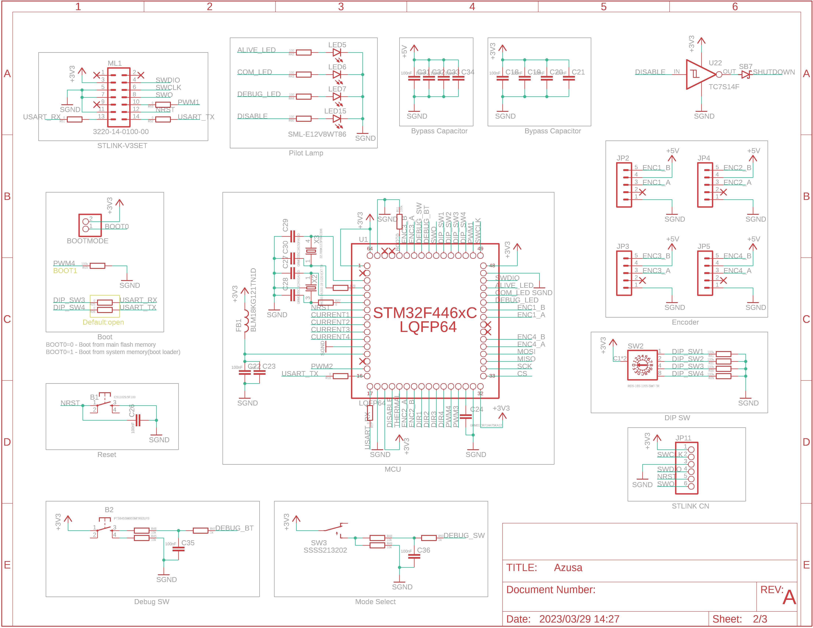
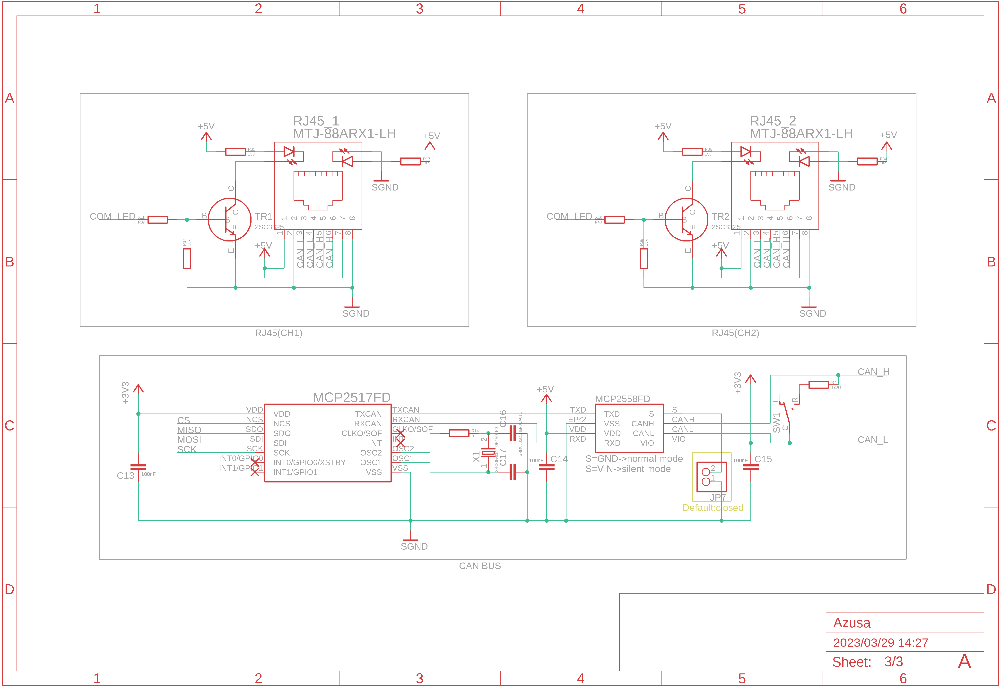

# アズサ(Azusa)

 
 

 
この基板はJLCPCB様のFree PCB Sponsorshipにて制作しています． 

## Overview
  [MotorDriver-Controller_v4](https://github.com/TNCT-Mechatech/MotorDriver-Controller_v4)の機能+αと電源回路を合体させた統合型電源基板 
 
## Environments
&emsp;
&emsp;&emsp;
 

## Usage

1. [DriveUnit Bseries](https://github.com/Issaimaru/MoterDriver_v1)を使用したいチャネルのカードエッジコネクタに差し込む． 
1. モータードライバを差し込んだエッジコネクタと同じチャネルにモータを接続し，必要に応じて同じチャネルのコネクタにロータリーエンコーダを接続する． 
1. 非常停止スイッチを刺したコネクタの下にあるトグルスイッチをONに，それ以外のトグルスイッチをOFFにする．
1. XT90とUSB Type-Cからそれぞれ電源を供給し，非常停止スイッチをONにすると稼働する．
> **Note** 
> USB Type-C用電源を省略する方法はDescriptionsを参照 

## Features
<dl>
  <dt>通信プロトコル</dt>
  <dd>CAN with Flexible Data Rate(CAN FD)</dd>
  <dt>通信用コネクタ・ケーブル</dt>
  <dd>RJ-45/LANケーブル</dd>
  <dt>マイクロコンピュータ</dt>
  <dd>STM32F446RE</dd>
  <dt>特殊回路</dt>
  <dd>
  ・オートディスチャージ回路 
  ・車載用スローブローヒューズ

  <dt>保護回路(電源側)</dt>
  <dd>
  ・過電流保護(閾値可変) 
  ・ヒステリシス付き過熱保護 
  ・短絡保護 
  ・突入電流抑制 
  </dd>
  <dt>保護回路(信号側)</dt>
  <dd>
  ・過電圧保護 
  ・過電圧クランプ 
  ・突入電流抑制 
  ・過電流保護(東芝のeFuseを使用) 
  ・過熱保護 

## Descriptions
本ハードウェアの使用方法を詳しく書いていきます． 
質問や連絡等あれば[@TakenMaker](https://twitter.com/TakenMaker)までお願いします． 

### 回路図
&ensp;&ensp;

#### 始動方法
始動方法については[Usage](#usage)で示しました． 
ここでは始動時の応用的な使い方について紹介していきます．

- 信号用バッテリーの省略

 

JP6で信号用の電源をUSB給電or外部給電に切り替えることができます． 
外部電源としては，SPOWのピンに接続された電源かリポバッテリーか選ぶことができます． 
リポバッテリーの場合は「GND」と「SPOW」のピンヘッダを短絡してください． 
その際にE5VのLEDが点灯していることを確認してください．

## Bills of materials
> **Note** 
>最低限の部品のみここに書いています． 
>はんだ付けに必要な部品を調べるときは以下のexcelファイルを見るか，BOMファイルを出力してください． 
>[アズサ(Azusa)-ver2.0_必要部品.xlsx](src/%E3%82%A2%E3%82%BA%E3%82%B5(Azusa)-ver2.0_%E5%BF%85%E8%A6%81%E9%83%A8%E5%93%81.xlsx)
 
<dl>
  <dt>マイクロコンピュータ</dt>
  <dd>

  [STM32F446RET6](https://www.digikey.jp/ja/products/detail/stmicroelectronics/STM32F446RET6/5175962)

  </dd>

  <dt>電流センサ</dt>
  <dd>
  
  [CZ-3A04](https://www.digikey.jp/ja/products/detail/asahi-kasei-microdevices-akm/CZ3A04/11570562)

  </dd>
  <dt>CANトランシーバ</dt>
  <dd>

  [MCP2558FDT-H/MNY](https://www.digikey.jp/ja/products/detail/microchip-technology/MCP2558FDT-H-MNY/6009304)

  </dd>
  <dt>CANコントローラ</dt>
  <dd>

  [MCP2517FDT-H/SL](https://www.digikey.jp/ja/products/detail/microchip-technology/MCP2517FDT-H-SL/7801797)

  </dd>
  <dt>ヒートシンク</dt>
  <dd>
  
  [V2020B](https://www.digikey.jp/ja/products/detail/assmann-wsw-components/V2020B/8826902)
  
  </dd>
  <dt>ヒューズ</dt>
  <dd>

  [0297030.WXT](https://www.digikey.jp/en/products/detail/littelfuse-inc/0297030-WXT/5233697)

  </dd>
  <dt>USB・シリアル変換IC</dt>
  <dd>

  [CH340E](https://akizukidenshi.com/catalog/g/gI-13543/)

  </dd>
  <dt>NTCサーミスタ</dt>
  <dd>

  [NCU15WB473F60RC](https://www.digikey.jp/ja/products/detail/murata-electronics/NCU15WB473F60RC/9686720)

  </dd>
  <dt>DIPスイッチ</dt>
  <dd>

  [RDS-16S-1055-SMT-TR](https://www.digikey.jp/ja/products/detail/cui-devices/RDS-16S-1055-SMT-TR/12424507)

  </dd>
</dl>

## Reference

## Author
    
<table>
  <tr>
    <td align="center"><a href="https://github.com/Issaimaru"> </a>Issaimaru</td>
  </tr>
</table>
    
## Licence
  - Copyright © 2022-2023 Issaimaru 

本ハードウェアは，Apache License Version 2.0の下で配布されます． 
詳しくはLICENSEファイルをご確認ください． 

## 回路図のダウンロード(クローン)方法
1. Gitをインストールする． Gitのインストール方法は[ここ](https://www.sejuku.net/blog/73444)を参照．
1. コマンドプロンプトを立ち上げる．
1. `cd ”ダウンロード先フォルダの絶対パス” ` 
1. `git clone https://github.com/Issaimaru/PowerSupply_v1.git` 
